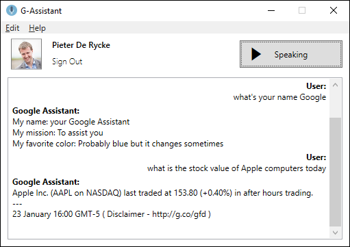

# Google Assistant Windows

*Updated to support the Google Assistant alphav2 API*

First attempt at getting the Google Assistant SDK in a C# WPF application. Created mostly on Windows having never used gRPC or OAuth before. Its not pretty but its marginally nicer than installing Python and using Google's example.

Comprises of 
- Tiny UI to login / Show the logged in user
- Minimise to Tray 
- Global Keyboard shortcut for activation - Ctrl+Alt+G

## Building

1. Clone the repo (optionally with submodules)
2. Restore the Nuget Packages
3. Create your own project on Google Cloud Console with Google Assistant API enabled and OAuth for it as per:
https://developers.google.com/assistant/sdk/prototype/getting-started-other-platforms/config-dev-project-and-account
4. Download the JSON file and move it to `client_id.json` in the `Secrets/` folder 
5. if you don't have Google Assistant or Google Home already also check that link for 'Set activity controls for your account' to ensure your account is setup for Assistant.

This assumes the generated code is up to date, if not..

### Generating the gRPC code

1. DownloadTools.ps1 will download the necessary tools to build the gRPC bindings
2. GenerateGoogleAssistantClient.ps1 will download the proto files from GitHub and will build the c# gRPC code

### Register the Device and Device Model

Ensure you have python 3 installed on your Windows machine

1. pip install --upgrade google-assistant-sdk
2. google-oauthlib-tool --scope https://www.googleapis.com/auth/assistant-sdk-prototype --headless --save --client-secrets Secrets\client_id.json
3. googlesamples-assistant-devicetool --client-secrets Secrets\client_id.json register-model --model "<your projectid>-mymodel" --type LIGHT --manufacturer "<your name>" --product-name "Assistant Test"
4. googlesamples-assistant-devicetool --client-secrets Secrets\client_id.json register-device --device "mylaptop" --model "<your projectid>-mymodel" --nickname "My Laptop" --client-type SERVICE

## Resources
http://developers.google.com/assistant/sdk/

http://grpc.io/docs/quickstart/csharp.html

## Credits 

https://www.freesound.org/people/TheGertz/sounds/235911/
https://www.freesound.org/people/cameronmusic/sounds/138417/
https://www.iconfinder.com/icons/1055024/audio_mic_microphone_icon
